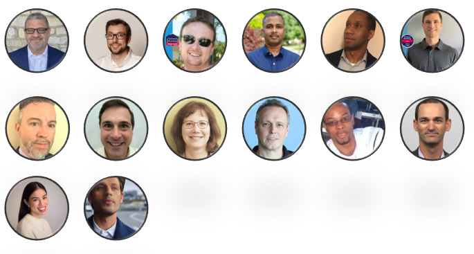

# Everyone Can Code! – Light Your Fire for Coding (U.S. Edition)

  

    Built with ❤ by everybody who wants to make the Microsoft App Dev Innovation world a little bit more diverse! 
  

# Welcome to our coding journey!

It's great to have you here! 🎉

“With barely 25% of employees in the technology industry being women and only 11% in leadership positions, these figures continue to highlight the challenges of gender equality in the tech world. Over the past nine years, the underrepresentation of women, especially those with diverse cultural backgrounds, persists across the corporate landscape” (McKinsey & Company, [_Women in the Workplace 2023_](https://www.mckinsey.com/featured-insights/diversity-and-inclusion/women-in-the-workplace)).

This is why we want to encourage everyone to bring their skills and passions to the world of technology, to explore new horizons together, and to shape the future of the industry together. **Anyone who is creative and curious, regardless of age, gender, or profession, can participate in “Everyone Can Code.”**

**Join us for a groundbreaking online coding event** specifically designed to empower individuals and help you learn how to start writing your own coding stories with us.  You may have heard that coding can seem complex, but it is really nothing more than a language and technology that provides a magic pen in which we can paint the world around us. There's no such thing as “I can’t do it”.

This event is perfect for anyone who has ever been curious about coding but wasn't sure where to start. With expert instructors, hands-on activities, and a supportive community, you will be amazed at how much you can accomplish in just a few hours. **No previous code or other technical experience is required.**

**To get started click [here](./Track_1_ToDo_App/README.md)**

## Contributor Wall of Fame
Special thanks to the team that has worked on this to make it possible

### Core Team

## Contributing

This project welcomes contributions and suggestions.  Most contributions require you to agree to a
Contributor License Agreement (CLA) declaring that you have the right to, and actually do, grant us
the rights to use your contribution. For details, visit https://cla.opensource.microsoft.com.

When you submit a pull request, a CLA bot will automatically determine whether you need to provide
a CLA and decorate the PR appropriately (e.g., status check, comment). Simply follow the instructions
provided by the bot. You will only need to do this once across all repos using our CLA.

This project has adopted the [Microsoft Open Source Code of Conduct](https://opensource.microsoft.com/codeofconduct/).
For more information see the [Code of Conduct FAQ](https://opensource.microsoft.com/codeofconduct/faq/) or
contact [opencode@microsoft.com](mailto:opencode@microsoft.com) with any additional questions or comments.

## Trademarks

This project may contain trademarks or logos for projects, products, or services. Authorized use of Microsoft 
trademarks or logos is subject to and must follow 
[Microsoft's Trademark & Brand Guidelines](https://www.microsoft.com/en-us/legal/intellectualproperty/trademarks/usage/general).
Use of Microsoft trademarks or logos in modified versions of this project must not cause confusion or imply Microsoft sponsorship.
Any use of third-party trademarks or logos are subject to those third-party's policies.
