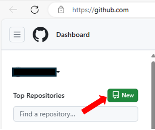
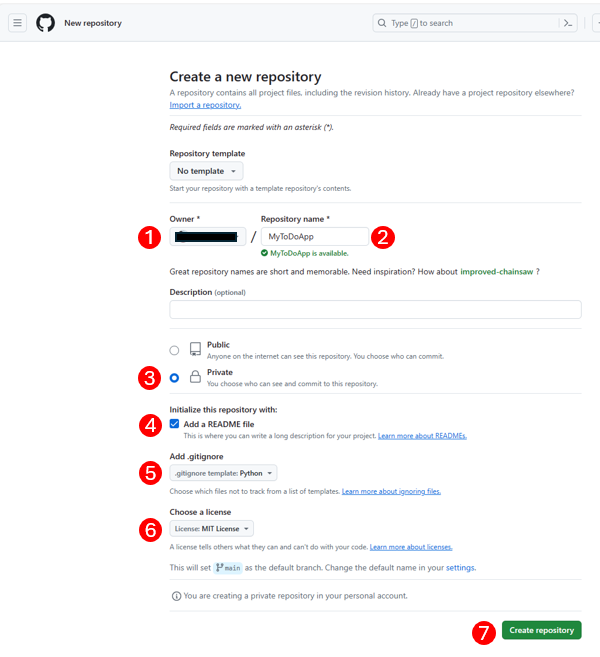
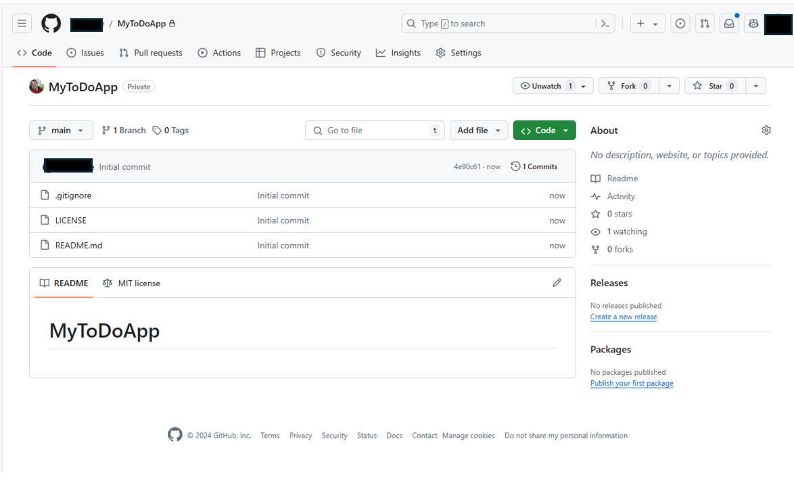

# Setup To-Do Application Repository
⏲️ _Est. time to complete: 5 min._ ⏲️

## 🎯Here is what you will learn 
You will learn the following:
- How to create a new repository to host your project

## Create To-Do Application Repository
The first thing that we will want to do as we think about building a new project is to spin up a new GitHub repository for that project.

### 1. Login to your GitHub Account 
Make sure that you are on the GitHub home page (i.e., [https://github.com](http://www.github.com)) and logged in via the account that you created in the last step.

### 2. Create New Repo

#### 1. From the left pane of the homepage, select the _New_ button to create a new repository

#### 2. Fill out all of the information for the new repository:

1. **Choose an owner** - Select the GitHub alias that you just created in the previous step
2. **Repository name** - You can use any name you would like to represent the project, in this case I chose the name _MyToDoApp_
3. **Public/Private** - This option determines whether or not this repo is by default publically available to everyone.  For this exercise we will start by having this repo be Private.
4. **Add a README file** - This creates a readme.md in the root of the project.  We have selected to include this
5. **Add .gitignore** - Please select `Python` as the template to use for this file. 
6. **Choose a License** - Please select `MIT License` as this is the default license that is being used for the Everyone Can Code event.
7. After setting all of these values, please select the _Create respository_ button.  This will create a new repository and should look something like this:

 

[🔼 Home](/Track_1_ToDo_App/README.md) | [◀ Previous setup step](./01%20-%20Setup%20GitHub%20Account.md) | [Next setup step ▶](02a%20-%20Use%20GitHub%20CodeSpaces.md)

