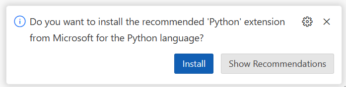

# 📖 User Story: Add Item to List - Step-by-Step
⏲️ _Est. time to complete: 15 min._ ⏲️

## User Story

*As a user, I want to be able to add a to-do item to the list by entering the item name and pressing the enter key.*

## 🎯Acceptance Criteria:
- The application should have a command-line/terminal interface that allows the user to add items to the list. 
- The user should be able to add one item to the list at a time. 
- The user should be able to see the complete list of items after adding a new item.
- The user should be able to continue to add items to the list until they choose to exit the program.
- The interface should look something like this:
    

## 🎓Know Before You Start
The following resources/videos will help you get a better understanding of some of the basic Python concepts that you will use to complete this user story.
- [The Basic: Using the Print Statement](https://www.youtube.com/watch?v=FhoASwgvZHk&list=PLlrxD0HtieHhS8VzuMCfQD4uJ9yne1mE6&index=5) (3:29 min) <br/>
- [Hello World](https://www.youtube.com/watch?v=wWwr0tDSqnE&list=PLlrxD0HtieHhS8VzuMCfQD4uJ9yne1mE6&index=6) (5:59 min)<br/>
- [Comments](https://www.youtube.com/watch?v=kEuVvUc1Zec&list=PLlrxD0HtieHhS8VzuMCfQD4uJ9yne1mE6&index=7) (3:04 min)<br/>
- [Understanding Conditional Logic](https://www.youtube.com/watch?v=5pPKYWqkoek&list=PLlrxD0HtieHhS8VzuMCfQD4uJ9yne1mE6&index=19) (4:52 min)<br/>
- [Understanding Collections in Python](https://www.youtube.com/watch?v=beA8IsY3mQs&list=PLlrxD0HtieHhS8VzuMCfQD4uJ9yne1mE6&index=25) (11:26 min)<br/>
- [Demo: Collections in Python](https://www.youtube.com/watch?v=4PaSlXNjawM&list=PLlrxD0HtieHhS8VzuMCfQD4uJ9yne1mE6&index=26) (4:01 min)<br/>
- [Loops](https://www.youtube.com/watch?v=9Os0o3wzS_I&list=PLlrxD0HtieHhS8VzuMCfQD4uJ9yne1mE6&index=27) (5:29 min)

## 📋Steps

In order to complete this user story you will need to complete the following tasks

### Making your first application

#### 1. Start your Codespace or Open Visual Studio Code locally

If you are using Codespaces, please go into the repo that you created for this project and start the codespace by directly clicking on the Codespace name.  In the case of the image below, the Codespace is named _symmetrical computing-machine_. Note however, that each Codespace auto-generates a unique name for that code space so your Codespace name will be different.  


This will take you directly into an online Visual Studio Code environment.


<details>
<summary>click <b>here</b> if you would prefer to run Visual Studio Code in a local development environment</summary>

- From the terminal/console window, navigate to the project directory
  
    ```bash
    cd <project directory>
    ```
- Open up Visual Studio Code in the project directory by executing the following command.
    
    ```cmd
    code . 
    ```
</details> 

<br/>

#### 2. Create the `app.py` application file
Every program needs a starting point. Create a new file named `app.py` in the root of your project folder. Select the new file icon as seen below (this will appear when you hover over the explorer pane):


then, in the text field that appears, enter the name of the file `app.py` and press `<ENTER>`.


<br/>

#### 3. Create the collection to hold the to-do items
Create an empty collection to hold your to-list items with the variable named `todo_list` by adding the following code to the top of the `app.py` file.
    
```python
todo_list = []
```

> [!NOTE]
> You may be prompted by Visual Studio Code asking you if you would like to install the 'Python' extension from Microsoft.  If you see this dialogue, please select the `Install` button.
> 
>
> This extension provides rich support for the Python language (for all actively supported Python versions), providing access points for extensions to seamlessly integrate and offer support for IntelliSense (Pylance), debugging (Python Debugger), formatting, linting, code navigation, refactoring, variable explorer, test explorer, and more!
<br/>

#### 4. Create some sample to-do items
Create a few sample to-do items in the list by adding the following code to the `app.py` file right after the 'todo_list' variable declaration.

```python
todo_list.append("Buy milk")
todo_list.append("Learn more about Azure")
todo_list.append("Complete first Python project")
```

The append method on a collection is used to add items to the list. In this case, we are adding three items to the list.

<br/>

#### 5. Print the list to the console
Now we will want to see that we succesfully added all of those sample to-do items to the list. You can do this by printing the list to the console.  Add the following code to the `app.py` file right after the `append` statements.

```python
for todo in todo_list:
    print(todo)
```

This code will loop through the `todo_list` and print each item to the console. Your code should now look something like this:


<br/>

#### 6. Run the application 
Now let's see this application in action. Open a terminal window within visual studio code by holding down ctrl+shift+p then typing 'terminal' and selecting 'View: toggle terminal'. In the terminal window that opens at the bottom run the application by typing `python app.py` and pressing the `<ENTER>` key. You could also simply click the play button on the top right corner of the Visual Studio Code window.


> [!NOTE]
> The picture above assumes a local setup.  If you are running in Codespaces it you should click the play button on the top right corner of the Visual Studio Code window


🎉 Congratulations, you now have successfully added several to-do items to the list and created the initial code for this to-do list application.  Note however that this is **not a user-friendly** way to interact with the application as all of the to-do items are "hard-coded" meaning they are written directly in the code.  This also does not meet the acceptance criteria we have outlined above. In the next step you will be adding a user-friendly command-line interface to the application.

<br/>

### Update the application to be interactive

#### 1. Add a menu to the application
In order to create the user-friendly version of this application, we will need to create a basic menu structure to allow the user to add an item to the to-do list. First, we need to update the code by first removing all the previous 'todo_list.append' statements and the 'for' loop statements to remove the 'hard-coded' sample to-do items. 


and replace it with the following code.

```python
# continue to loop and display menu until the user selects to exit the program
while True:
    print() # add a couple of blank lines
    print()
    print("To-do list: ") # print the title of the list
    for todo in todo_list: # loop through existing to-do items
        print(todo)

    # Print the menu
    print() # add a blank line
    print("Actions:")
    print("A - Add to-do item")
    print("X - Exit")
    choice = input("Enter your choice (A or X): ")
    choice = choice.upper() # converts the choice to uppercase

    # user selected 'a' or 'A' to add an item to the list
    if choice == "A":
        todo = input("Enter the to-do item: ") 
        todo_list.append(todo)
        continue  # tells the program to go back to the start of the loop

    # user selected 'x' or 'X' to exit the program
    if choice == "X":
        break # tells the program to exit the loop

    # user selected something else
    print("Invalid choice")
```
This code creates a while loop to run over an over again until the user wishes to exit the program by typing "x" or "X".  In each iteration of the while loop it will...
- first loop through the collection of to-do items and print them to the screen
- display the menu 
- accept input from the user on which menu item to perform and will then execute the corresponding code related to the menu item. 

<br/>

#### 2. Run the application with the menu
Now let's see this application in action with the menu system in place. Open the terminal in Visual Studio Code and run the application by typing `python app.py` and pressing the `<ENTER>` key or simply click the play button in the top right corner of the Visual Studio Code window.


> [!NOTE]
> The picture above assumes a local setup. If you are running in Codespaces, you should click the play button on the top-right corner of the Visual Studio Code window.

You should see a menu structure where you can interact with the application. Pressing 'a' or 'A' (and hitting `<ENTER>`) allows you to add an item to the list. Please experiment by adding a few to-do items to your list. (Note you will also have to hit `<ENTER>` after typing in your to-do list item name to have it accept the input and add it to the list). Remember you will need to press 'x' or 'X' (and hitting `<ENTER>`) to exit the program.

Here's what my application looks like after adding a few items to the list:


🎉 Hooray! You have now added a user-friendly command-line interface to the application and finished Sprint 1 - Feature 1, User Story 1. You can now add items from the to-do list by entering the item name and pressing the `<ENTER>` key.

<br/>

> [!NOTE]  
> 📄For the full source code for this exercise please see [here](/Track_1_ToDo_App/Sprint-01%20-%20Basic%20Application/src/app-s01-f01-us01/app.py).

<br/>

[🔼 **Home** ](/Track_1_ToDo_App/README.md) | [**Next user story ▶**](/Track_1_ToDo_App/Sprint-01%20-%20Basic%20Application/Feature%201%20-%20Manage%20Todo%20List/User%20Story%202%20-%20Remove%20Item%20from%20List.md)


