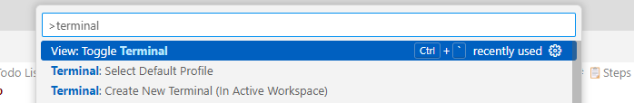

# 📖 User Story: Convert to Web App - Step-by-Step
⏲️ _Est. time to complete: 20 min._ ⏲️

## User Story

*As a user, I want to access the application through a web browser, so I can use it on any device with internet connectivity.*

## 🎯Acceptance Criteria:
- Users should be able to access the web app using common web browsers such as Chrome, Firefox, and Edge.
- For this first step, only the ability to print out the saved to-do items is required. The ability to add and remove items will be added in the next user stories. 
- The application should have a user-friendly web interface.  The interface should look something like this:
 
    

## 🎓Know Before You Start
no resources at this time


## 📋Steps

In order to complete this user story, you will need to complete the following tasks:

### Install Web Framework
The first step in converting the application to a web application is to install a web framework. We will be using **Flask** - a lightweight web framework that is both easy to use and perfect for small projects like this.

#### 1. Open Visual Studio Code
Open Visual Studio Code (either locally in the project directory you setup or through your Codespace). Visual Studio Code should have your completed solution from the end of Sprint 1 or if you prefer you can use the starting reference application from [here](/Track_1_ToDo_App/Sprint-01%20-%20Basic%20Application/src/app-s01-f02-us02/) by copying it over into your local directory or Codespace. 

<br/>

#### 2. Setup Flask Environment
If Flask is not already installed, you can install it via pip from a terminal window in Visual Studio Code. Open the terminal window by doing the following: hold `ctrl+shift+p`, type 'terminal' and select "View: Toggle Terminal"...this will open a terminal at the bottom of your screen. 



In this bottom screen enter the following command:

```
pip install flask
```
> [!NOTE]
> If you setup the virtual environment through the sprint 0 instructions, then Flask will already be installed, you can verify it by `pip list` in the terminal window and verify the Flask module is listed.

<br/>

### Convert the Application to a Web Application
> [!TIP]
> You can ask GitHub Copilot to convert a basic Python file to a web app. It will generally work well at converting to a starting point you can adjust and work with. Try it out with a prompt such as: *Convert this app to a flask based web app*

#### 1. Add Flask to the Application
We now need to update our application to include the Flask framework. Open `app.py` and import some important packages from Flask by adding the following to the very top of the file (i.e., above the `todo_list = []` line):

```python
from flask import Flask, render_template, request, redirect, url_for
```

- `flask` is the package allowing you to create a web application
- `render_template` is a function to allow you to render an HTML file
- `request` is a package allowing you to handle requests from the user
- `redirect` and `url_for` are packages to allow you to redirect the user to a different page and get the final URL for the given relative path.

<br/>

#### 2. Import the os Package
Next, we want to import the os package to handle file operations. Add the following to the top of the file right after the `from flask...` statement:

```python
import os
```

`os` is a package allowing you to interact with the operating system. We will use it to find the current directory of the application so we know where to store the file.

<br/>

#### 3. Initialize the Flask App
To use the Flask framework, you will need to initialize the Flask app. To do this, add the following right after the `import os` statement in step 2 and before the `todo_list = []` statement:

```python
app = Flask(__name__)
```

`__name__` is a special variable in Python representing the name of the currently-running module. If the script is running directly, such as `python app.py`, the value will be "\_\_main\_\_"

<br/>

#### 4. Get location of the to-do list file 
Since this app will be running as a web application, we want to make sure we load the to-do list from the correct location. Let's create a variable to find the current directory in which this web application is running as well as create the variable to store were the to-do list will be stored. Put this code right underneath your app initialization:

```python
basedir = os.path.abspath(os.path.dirname(__file__))
todo_file = os.path.join(basedir, "todo_list.txt")
```

`__file__` is another special variable that represents the current file - the app.py in our application.

<br/>

#### 5. Load the to-do list from the file
We need to make sure we are loading the file from the right directory. Replace the `with open(...)` statement in the file with the following code:

```python
with open(todo_file, "r") as file:
```  

This code replaces the prevously hard-coded file name with the variable `todo_file` we created in the earlier sprint to ensure we are loading from the right location.

<br/>

#### 6. Create a route for the homepage
Now that we are using the Flask Framework, the `app.py` file will now represent the back-end web server logic that will run when you spin up the website. We will need to define the entry point for the application on the back-end web server by creating "routes". Routes represent the URL paths a browser will call to access our functionality. We need to define a route for the homepage. To do this, add the following code snippet below to replace ALL of the code starting with the `while True:` statement all the way to the end of the file. This code is no longer needed for the web application.

Replace the code in the red box below:


with the this code:

```python
@app.route("/")
def index():
    return render_template("index.html", todo_list=todo_list)
```

Routes are defined using the `@app.route` decorator. This decorator tells Flask the function below is a route. The route is the homepage or root of the application ("/"). The function below the decorator is called index. This function will simply pass the todo_list variable to the index.html file to render the list of to-do items in a web page.

<br/>

#### 7. Create Application starting point
Finally, to enable the app to run, you need to add this code to the bottom of the `app.py` file:

```python
if __name__ == "__main__":
    app.run(debug=True)
```

This code will include the Flask app when you run the Python script. The debug=True parameter will allow you to see any errors in the browser when you run the app.

> [!NOTE]
> In a production environment you would set Debug=False so end-users would NOT see a all of this detail when something fails.

<br/>

#### 8. Create the User Interface for the Web Application
We have created the backend functionality to run the Flask app, but we still need to define a web page to render the UI when the user hits the home page. We will need to define the html to display when the homepage route is engaged. 

Create a ```index.html``` file in a subfolder called ```templates```. The ```templates``` folder should be in the root directory of your project.   


Add the following code to this index.html file:

```html
<!DOCTYPE html>
<html>
<head>
    <title>To-Do List</title>
</head>
<body>
    <h1>To-Do List</h1>
    <ol>
        
            <li>{{ todo }}</li>
        
    </ol>
</body>
</html>
```

This code will create a basic HTML page displaying the to-do list items in an ordered list (<ol>). The `` loop will iterate through each item in the todo_list and display it as a list item (<li>). The `{{ todo }}` will display the item name in the list. The use of `` in the HTML is used to render dynamic content for a Flask application and are called Jinja2 templates.

<br/>

#### 9. Run the Application
Open the terminal and navigate to the folder where your `app.py` file is located. Run the application by typing `python app.py` and pressing the enter key or simply click the play button in the top-right corner of the Visual Studio Code window. For Codespaces, just click the play button. This will launch a browser and navigate to the home page (or you can browse to http://localhost:5000).

[OPTIONAL] You can add tasks to a todo_list.txt file to see them display on the page.

Stop the server by pressing `CTRL-C` in the terminal window where the web server is running.

<br/>


🎉 Congratulations! You have now updated your basic application to a most basic web application. In the next set of user stories, we will re-implement the functionality to add and remove a to-do list item from our list.

<br/>

> [!NOTE]
> 📄For the full source code for this exercise, please see [here](/Track_1_ToDo_App/Sprint-02%20-%20Web%20Application/src/app-s02-f01-us01/).

<br/>

[🔼 Home ](/Track_1_ToDo_App/README.md) | [**◀ Previous user story** (in previous sprint)](/Track_1_ToDo_App/Sprint-01%20-%20Basic%20Application/Feature%202%20-%20Save%20To-Do%20List/User%20Story%202%20-%20Load%20To-Do%20List%20from%20File.md) | [**Next user story** ▶](User%20Story%202%20-%20Add%20Item%20through%20Web%20Form.md)
