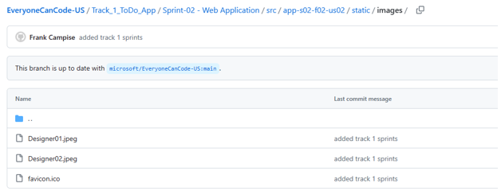
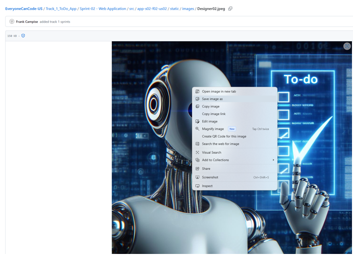

# Download Background Image to your PC

## 📋 Steps

### 1. Get Source Image
If you want to use the pre-created image you can find it in this [**directory**](/Track_1_ToDo_App/Sprint-02%20-%20Web%20Application/src/app-s02-f02-us02/static/images/)

### 2. Save Image Locally 

1. Select the `Designer02.jpeg` file which should bring up the picture within the repo. Simply 
2. Right-click on the image and select **Save image as** to bring up a file dialogue box.

3. In the file dialogue box, find a directory on your local machine to temporarily store the image.

 

[🔼 Back Personalize Web Application User Story  ](./User%20Story%202%20-%20Personalize%20Website.md#1-create-or-use-a-background-picture)