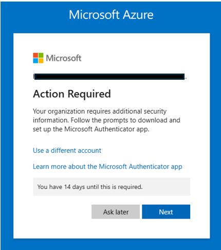
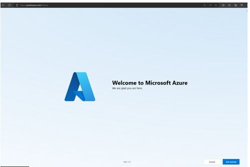
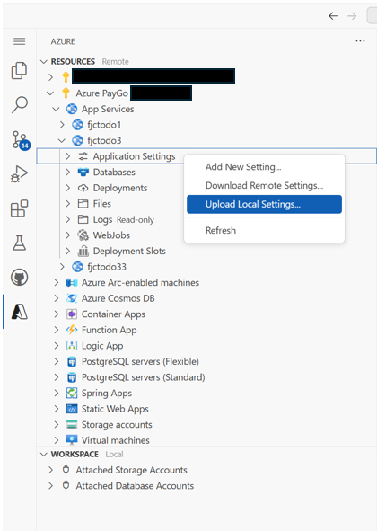
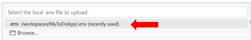
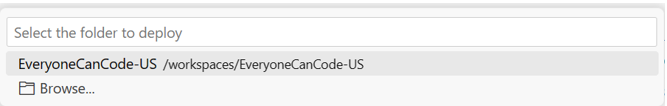

# User Story: Deploy to Azure (Shared Subscription) Step-by-Step

⏲️ _Est. time to complete: 30 min._ ⏲️

## User Story

As a user I want to deploy my solution to the cloud so that I can access my application at any time.

## 🎯Acceptance Criteria:
- Azure SQL Database named _todo_ is created and todo items are persisted by the application.
- Azure App Service is with Python runtime environment is created and deployed application.
- Created database connection string using the Azure SQL Database information to connect through my application to persist todo items.
- Configured Azure OpenAI information to access as environment variables using Azure App Service settings in my application.

## 🎓Know Before You Start
The following resources/videos will help you get a better understanding of some of the concepts that you will use to complete this user story.

- [What is Cloud Computing](https://learn.microsoft.com/en-us/training/modules/describe-cloud-compute/3-what-cloud-compute) (~3 minutes) <br/>

## 📋Steps

In order to complete this user story you will need to complete the following tasks:

### Setup Your Azure Cloud Environment

#### 1. Login in to the Azure Portal
To use Azure, we first need to login with our Azure credentials. Go to [**https://portal.azure.com**](https://portal.azure.com)

If you are part of the _Everyone Can Code_ event, you will be given Azure credentials by your coach.  If you are doing this exercise outside of the event you can sign-up for Azure [here](https://azure.microsoft.com/en-us/) and then provide those credentials when completing this exercise.

After logging in you may get prompted with an _Action Required_ dialogue similar to the one below:



For this event, you an simply select **Ask Later**, however if this was an account you created, we would highly recommend you fill out the additional security information. 

You may also get a second dialogue asking you if you would like to "Stay signed in?".  You can simply say _Yes_ to that as well.

That will likely take you to the Azure Welcome page:



You can either hit _Cancel_ or go through the _Getting Started_ pages.   In either case you should land on the home page for the azure portal which will look something like this:


> [!NOTE]
> If you are not part of the 2 day Everyone Can Code Event, you can use your own Azure credentials or you can sign up [here to get started](https://azure.microsoft.com/en-us/free/).
<br/>

#### 2. Setup Azure Sql Database
Choose **create a resource** option from the home page


Search for **sql database** in the search box


Select SQL Database option to go to the create screen


On the create screen, select create and then complete the form as follows, keeping defaults for everything except the following:

* choose a resource group (or create a new one if one is not provided or you are not sure here).  
* **database name:** todo
* **Server:** You will need to create a new server, click the *create new* link and complete the form for creating a server as follows:

* **Server Name:** everyonecancode-<random> (replace random with a unique set of characters to make this globally unique)
* **Region:** East US. Choose a region appropriate for where you are deploying the app. If you are in the US, East US is ok as starting point if you are unsure.
* **Authentication:** Change the selection to *Use SQL Authentication** and enter an admin username (e.g. sqladmin) and unique password

> [!NOTE]
> if you are participating in the event both your resource group and server should already have been pre-created so you simply need to just select it from the drop-down


* **Backup Storage Redundance:** Change to *Locally-redundant backup storage* 

Click *Review and Create* and then *Create* to start getting your database provisioned.


### Setting up an Azure Web App Service
Now that we have setup the database we have to create the Azure Web App Service to host our web app.

#### 1. Set up Azure Web App Service in Azure Portal

Go back the home page of your Azure Portal and click *Create a Resource* again. This time, enter *Web App* in the search box and choose the Web App option.


On the next screen hit create. Complete the form as follows, changing the following items and keeping defaults for all others:

* **Resource Group:** Choose the resource group you used for your Azure SQL Database
* **Name:** Give your webapp a unique name that no one else in the world will use (e.g. <yourinitials-everyonecancode>)
* **Runtime Stack:** choose Python 3.12
* **Pricing Plan:** Choose Free Tier

Hit *Review and Create* and the *Create* to provision your Web App


### Update Application Logic

#### 1. Update code to use Azure App Service database connection string environment variable

Open `app.py` file, find these lines of code near the top of the file:

```python
basedir = os.path.abspath(os.path.dirname(__file__))   # Get the directory of the this file
todo_file = os.path.join(basedir, 'todo_list.txt')     # Create the path to the to-do list file using the directory
app.config["SQLALCHEMY_DATABASE_URI"] = 'sqlite:///' + os.path.join(basedir, 'todos.db')
app.config['SQLALCHEMY_TRACK_MODIFICATIONS'] = False
```
and replace these with the following lines:

```python

# mssql+pyodbc://<sql user name>:<password>@<azure sql server>.database.windows.net:1433/todo?driver=ODBC+Driver+17+for+SQL+Server
connection_string = os.environ.get("SQLAZURECONNSTR_AZURE_SQL_CONNECTIONSTRING", '')

# Use local database if Azure SQL server is not configured
if not connection_string:
    print('Azure SQL not configured, Using local SQLLite database')
    basedir = os.path.abspath(os.path.dirname(__file__))   # Get the directory of the this file
    print('Base directory:', basedir)
    todo_file = os.path.join(basedir, 'todo_list.txt')     # Create the path to the to-do list file using the directory
    app.config["SQLALCHEMY_DATABASE_URI"] = 'sqlite:///' + os.path.join(basedir, 'todos.db')
else:
    print('Using Azure SQL database')
    app.config["SQLALCHEMY_DATABASE_URI"] = connection_string

```

Pay attention to the _SQLAZURECONNSTR_AZURE_SQL_CONNECTIONSTRING_ environment variable is in this code snippet. The prefix **SQLAZURECONNSTR_** indicates it is a Azure SQL database connection string environment variable. You will create this environment variable later steps.

#### 2. Update recommendations engine code to use Azure App Service environment variables
We also want to update to use environment variables for all of the OpenAI configuration information. 

1. Open `recommendation_engine.py` file and replace the following imports:

```python
import json
import asyncio
import semantic_kernel as sk
from services import Service
from openai import AzureOpenAI
from dotenv import dotenv_values
```

with these imports:

```python
import os
import json
import asyncio
from services import Service
from openai import AzureOpenAI
```

These changes get rid of the `os`, `semantic_kernel`, and `dotev` modules


2. Replace the `def __init__(self)` function with the following code:

```python
    def __init__(self):
        self.deployment = os.environ.get("AZURE_OPENAI_DEPLOYMENT_NAME", '')
        api_key = os.environ.get("AZURE_OPENAI_API_KEY", '')
        endpoint = os.environ.get("AZURE_OPENAI_ENDPOINT", '')
        use_open_ai = os.environ.get("USE_AZURE_OPENAI", 'True')

        #uses the USE_AZURE_OPENAI variable from the .env file to determine which AI service to use
        #False means use OpenAI, True means use Azure OpenAI
        selectedService = Service.AzureOpenAI if use_open_ai == "True" else Service.OpenAI
        if selectedService == Service.AzureOpenAI:
            self.client = AzureOpenAI(azure_endpoint = endpoint, 
                        api_key=api_key,  
                        api_version="2024-02-15-preview"
                        )
        else:
            raise Exception("OpenAI not implemented")     
```

This updates the code to get information from the enivronment variables instead of the `.env` file. 


#### 3. Add Azure Web App Config Settings

Go back to the browser, navigate to the Azure Portal and find your Web App you deployed earlier. Open the web app and navigate to the Settings->Environment Variables section


Under App Settings add the following settings and the values you have used prior
- AZURE_OPENAI_KEY: (use key from prior sprints)
- AZURE_OPENAI_DEPLOYMENT_NAME: gpt-35-turbo
- AZURE_OPENAI_ENDPOINT: (use endpoint from prior sprints)
- USE_AZURE_OPENAI: True

And then switch to the connection strings section and add the following connection string, replacing the password with the one you used when you created your SQL Database.


### Deploying to Azure
Go to your source code in your Codespace. We will need to make some minor adjustments to the app to prepare it for deploying to Azure.

#### 1. Create requirements.txt file to install Python modules

To deploy this application to Azure the Python code in this application depends on other Python modules. These modules are not readily available when you create a new Web Application in Azure App Service. To deploy these dependent modules you need to prepare a requirements.txt file, which is then used by Azure App Service to deploy these modules to run the application. Create a top level file (at the same level as your app.py file) called requirements.txt and add the following to it.

```python
openai
flask
flask[async]
flask_sqlalchemy
sqlalchemy
semantic-kernel==0.9.5b1
pyodbc
fastapi
```


#### 2. Install **Azure Tools** extension
In order to help us deploy our code to Azure from within **Visual Studio Code** we will need to install a Visual Studio Code extension


1. Click on the Extension box on the left pane (or hit CTRL+SHIFT+X)
2. In the search box type in "azure" and the **Azure Tools** extension should be one of the top items returned in the search
3. Click on the _Install_ button to install this extension

#### 3. Log into extension


1. Click on the Azure tools extension
2. Click on the _Sign in to Azure..._ link
3. You will then be presented with a dialogue box.   Click on _Allow_ to allow the "Azure resources" extension to sign into Microsoft.


4. A browser window should open up on your desktop and will give you the ability to login.  Please use the credentials that you were given by the coach.


5. Once logged you should see a heirachy of Azure subscriptions and services.  Click into your subscription and find the App Service name that you just created.  In this case my Web App service is named `fjctodo3`


#### 4. Add Environment Variables
Using this new extension we will update some of the environment variables for our Web App to be able to function.

1. Right click on the _Applicatin Settings_ under the Web App that you just created and select the _Upload Local Settings..._ menu item



2. You should then pick the `.env` file that we setup in an earlier step.



This will bring in all of the Azure OpenAI keys into the environment variables for the web server. 

#### 5. Deploy code base to Web App
We are now ready to move our application to the cloud.  

1. Right click on the Web App Service and select the _Deploy to Web App..._ menu option


2. Pick the root directory of your project.  




#### 6. Access Application in Web Browser

Click on the _Browse_ or _Default domain name_ in the App Service overview page. Web page will open in a different tab, and if everything is working expected you should be able to view web page as shown below.

  

  

> [!CAUTION]
> Please note that once **your to-do application** is deployed to the cloud it **is running on the public internet and is accessible by anyone that has the URL to view and/or edit the information.  So, please do not put personal items in your to-do list**.   We would also **highly recommend that you setup security on the website**. You can enable this through the next user story.

<br/>
🎉 Congratulations! You have now successfully deployed your to-do application to the Azure cloud.  In the next exercise we will setup authentication.

<br/>

> [!NOTE]
> 📄For the full source code for this exercise please see [here](/Track_1_ToDo_App/Sprint-08%20-%20Deploy%20to%20the%20Cloud/src/app-s08-f01-us01/).

<br/>

[🔼 **Home** ](/Track_1_ToDo_App/README.md) | [**◀ Previous user story** (in previous sprint) ](/Track_1_ToDo_App/Sprint-07%20-%20Advanced%20Styling%20Your%20Web%20App/Feature%201%20-%20Advanced%20Styling/User%20Story%205%20-%20Show%20Spinner.md)
