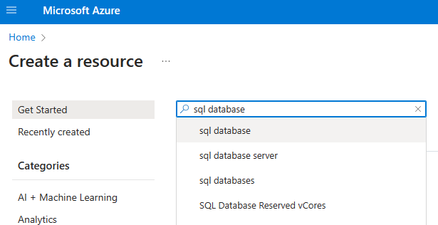
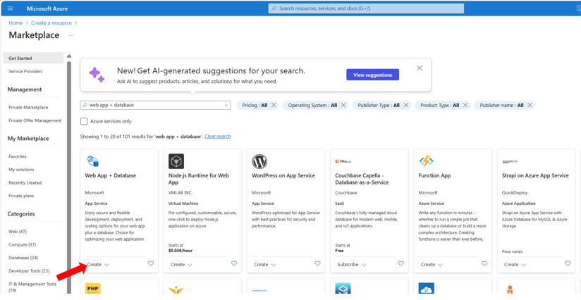
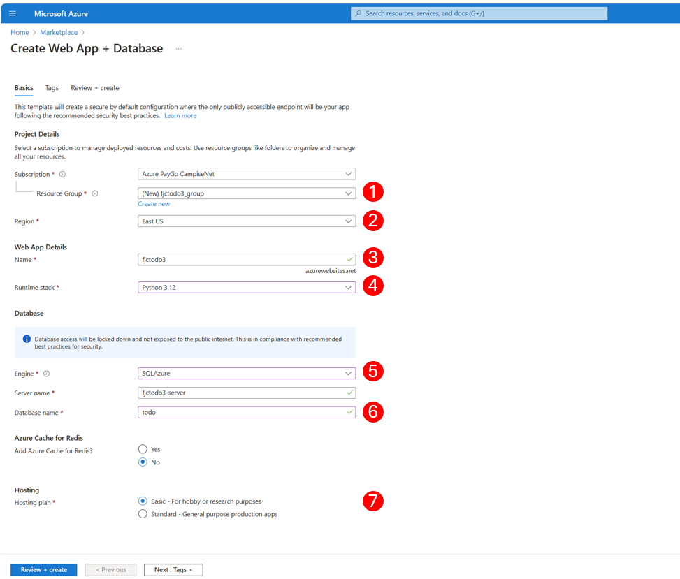
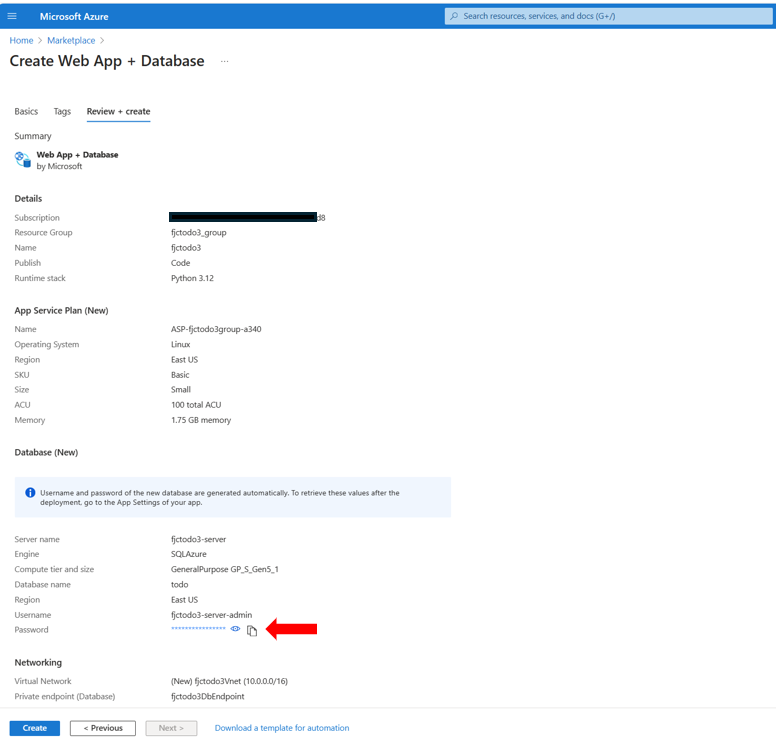
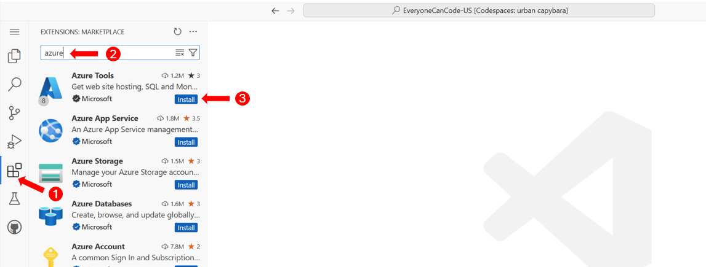
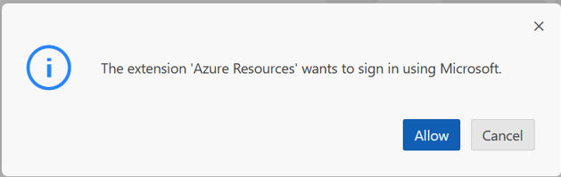
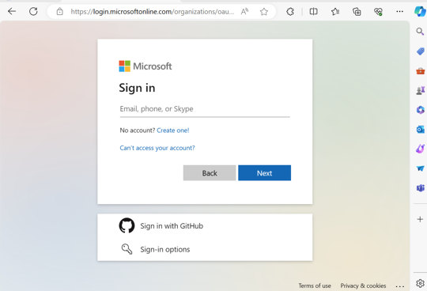
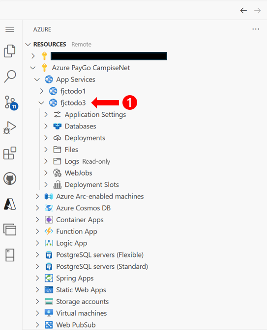
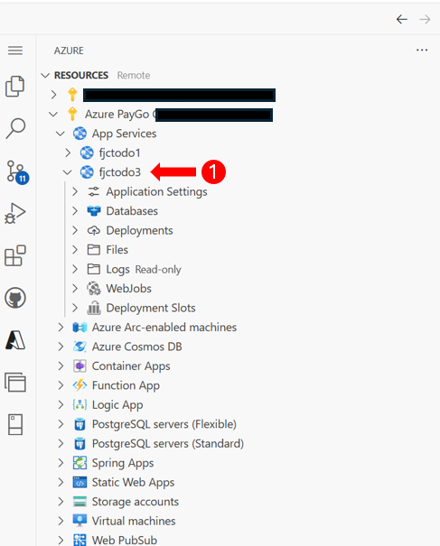
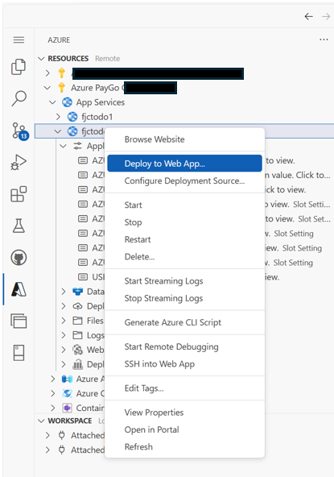

# User Story: Deploy to Azure Step-by-Step
⏲️ _Est. time to complete: 30 min._ ⏲️

## User Story

As a user I want to deploy my solution to the cloud so that I can access my application at any time.

## 🎯Acceptance Criteria:
- Azure SQL Database named _todo_ is created and todo items are persisted by the application.
- Azure App Service is with Python runtime environment is created and deployed application.
- Created database connection string using the Azure SQL Database information to connect through my application to persist todo items.
- Configured Azure OpenAI information to access as environment variables using Azure App Service settings in my application.

## 🎓Know Before You Start
The following resources/videos will help you get a better understanding of some of the concepts that you will use to complete this user story.

- [What is Cloud Computing](https://learn.microsoft.com/en-us/training/modules/describe-cloud-compute/3-what-cloud-compute) (~3 minutes) <br/>

## 📋Steps

In order to complete this user story you will need to complete the following tasks:

### Setup Your Azure Cloud Environment

#### 1. Login in to the Azure Portal
To use Azure we will first need to login with our Azure credentials.  If you are part of the event, you will be given Azure credentials by your coach.  If you are doing this exercise outside of the event you can sign-up for Azure [here](https://azure.microsoft.com/en-us/) and then provide those credentials when completing this exercise.


> [!NOTE]
> If you are not part of the 2 day Everyone Can Code Event, you can use your Azure credentials or you can sign up [here to get started](https://azure.microsoft.com/en-us/free/).
<br/>

#### 2. Setup both the Azure SQL Database and Azure Web App Service
The next step to getting our to-do application running in the cloud is to setup the necessary infrastructure to allow our application to run in the cloud.  We will need to provision both a SQL database in the cloud as well as a web server in the cloud.   

A. From the portal home page, choose **create a resource** option 


B. Search for **web** in the search box and then you should see a bunch of options come up like the picture below.  Select, the **web app + database** option



C. Select the **Create** button for the _Web App + Database_ components



D. You will now need to configure your services information



Please fill in the following information and then click on the `Review + create` button
1. **resource group** - For the event, the subscription should already have a pre-allocated resource group for you to use.  Simply select that resource group.
2. **Region** - East US. Choose a region appropriate for where you are deploying the app. If you are in the US, East US is ok as starting point if you are unsure.
3. **Name** - Give your webapp a unique name that no one else in the world will use (e.g., <yourinitials-everyonecancode>)
4. **Runtime Stack:** - Choose `Python 3.12`
5. **Engine** - Choose `SQLAzure`
6. **Database name** - Choose `todo`
7. **Hosting plan** - Choose `Basic`

E. You should now see the _Review + create_ tab of the _Create Web App + Database_ setup pages.



1. First, you will want to click on the database password copy button and save that password for a later step
2. after you have safed the password, you should then select the `Create` button to start deploying your SQL database and Web App

You may want to keep that page open to see when your deployement is done.


### Updating the application code to support a cloud deployment

#### 1. Update code to use Azure App Service database connection string environment variable
The first change that we will make to the code is to update the connection string information in our code base to use an environment variable instead of be a relative path.

1. Open `app.py` file and make sure that you add an `import os` to the top of the file.

2. Find these lines of code near the top of the file:

```python
basedir = os.path.abspath(os.path.dirname(__file__))   # Get the directory of the this file
todo_file = os.path.join(basedir, 'todo_list.txt')     # Create the path to the to-do list file using the directory
app.config["SQLALCHEMY_DATABASE_URI"] = 'sqlite:///' + os.path.join(basedir, 'todos.db')
app.config['SQLALCHEMY_TRACK_MODIFICATIONS'] = False
```
and replace these with the following lines:

```python

# mssql+pyodbc://<sql user name>:<password>@<azure sql server>.database.windows.net:1433/todo?driver=ODBC+Driver+17+for+SQL+Server
sql_user_name = os.environ.get("AZURE_SQL_USER");
sql_password = os.environ.get("AZURE_SQL_PASSWORD");
azure_sql_server= os.environ.get("AZURE_SQL_SERVER");
azure_sql_port = os.environ.get("AZURE_SQL_PORT");

connection_string = f"mssql+pyodbc://{sql_user_name}:{sql_password}@{azure_sql_server}:{azure_sql_port}/todo?driver=ODBC+Driver+17+for+SQL+Server"

# Use local database if Azure SQL server is not configured
if not azure_sql_server:
    print('Azure SQL not configured, Using local SQLLite database')
    basedir = os.path.abspath(os.path.dirname(__file__))   # Get the directory of the this file
    print('Base directory:', basedir)
    todo_file = os.path.join(basedir, 'todo_list.txt')     # Create the path to the to-do list file using the directory
    app.config["SQLALCHEMY_DATABASE_URI"] = 'sqlite:///' + os.path.join(basedir, 'todos.db')
else:
    print('Using Azure SQL database')
    app.config["SQLALCHEMY_DATABASE_URI"] = connection_string

```

#### 2. Update recommendations engine code to use Azure App Service environment variables
We also want to update to use environment variables for all of the OpenAI configuration information. 

1. Open `recommendation_engine.py` file and replace the following code:

```python
import json
import asyncio
import semantic_kernel as sk
from services import Service
from openai import AzureOpenAI
from dotenv import dotenv_values

config = dotenv_values(".env")

#uses the USE_AZURE_OPENAI variable from the .env file to determine which AI service to use
#False means use OpenAI, True means use Azure OpenAI
selectedService = Service.AzureOpenAI if config.get("USE_AZURE_OPENAI") == "True" else Service.OpenAI
```

with this new code:

```python
import os
import json
import asyncio
from services import Service
from openai import AzureOpenAI

deployment = os.environ.get("AZURE_OPENAI_DEPLOYMENT_NAME", '')
api_key = os.environ.get("AZURE_OPENAI_API_KEY", '')
endpoint = os.environ.get("AZURE_OPENAI_ENDPOINT", '')
use_open_ai = os.environ.get("USE_AZURE_OPENAI", 'True')

#uses the USE_AZURE_OPENAI variable from the .env file to determine which AI service to use
#False means use OpenAI, True means use Azure OpenAI
selectedService = Service.AzureOpenAI if use_open_ai == "True" else Service.OpenAI
```

The new code will use the environment variables to pull the values for the OpenAI service verus using a `.env` file.  Environment variables provide a more secure way of holding these values in the app service.

2. Also remove the following code from the `def __init__(self)` function:

```python
deployment, api_key, endpoint = sk.azure_openai_settings_from_dot_env()
```

#### 3. Create requirements.txt file to install Python modules

To deploy this application to Azure the Python code in this application depends on other Python modules. These modules are not readily available when you create a new Web Application in Azure App Service. To deploy these dependent modules you need to prepare a requirements.txt file, which is then used by Azure App Service to deploy these modules to run the application. Create a top level file (at the same level as your app.py file) called `requirements.txt` and add the following to it.

```python
openai
flask
flask[async]
flask_sqlalchemy
sqlalchemy
semantic-kernel==0.9.5b1
pyodbc
fastapi
```

### Deploying to Azure

#### 1. Install **Azure Tools** extension
In order to help us deploy our code to Azure from within **Visual Studio Code** we will need to install a Visual Studio Code extension



1. Click on the Extension box on the left pane (or hit CTRL+SHIFT+X)
2. In the search box type in "azure" and the Azure Tools extension should be one of the top items returned in the search
3. Click on the _Install_ button to install this extension

#### 2. Log into extension


1. Click on the Azure tools extension
2. Click on the _Sign in to Azure..._ link
3. You will then be presented with a dialogue box.   Click on _Allow_ to allow the "Azure resources" extension to sign into Microsoft.



4. A browser window should open up on your desktop and will give you the ability to login.  Please use the credentials that you were given by the coach.



5. Once logged you should see a heirachy of Azure subscriptions and services.  Click into your subscription and find the App Service name that you just created.  In this case my Web App service is named `fjctodo3`




#### 3. Add Environment Variables
Using this new extension we will update some of the environment variables for our Web App to be able to function.

1. Right click on the _Applicatin Settings_ under the Web App that you just created and select the _Add New Setting..._ menu item



2. You will then be asked for the variable name as well as the value.  Please create the following variables:

- AZURE_OPENAI_KEY: (use key from prior sprints)
- AZURE_OPENAI_DEPLOYMENT_NAME: gpt-35-turbo
- AZURE_OPENAI_ENDPOINT: (use endpoint from prior sprints)
- USE_AZURE_OPENAI: True

#### 4. Deploy code base to Web App
We are now ready to move our application to the cloud.  

1. Right click on the Web App Service and select the _Deploy to Web App..._ menu option



2. Pick the root directory of your project.  


#### 5. Access Application in Web Browser

Click on the _Browse_ or _Default domain name_ in the App Service overview page. Web page will open in a different tab, and if everything is working expected you should be able to view web page as shown below.

  

  

> [!WARNING]
> Please note that **your to-do application** once deployed to the cloud **is running on the public internet and is accessible by anyone that has the URL to view and/or edit  information.  So please do not put personal items in your to-do list**.   We would **highly recommend that you setup security on the website** if you would like to continue to run it and use the to-do list functionality. 

<br/>
🎉 Congratulations! You have now successfully deployed your to-do application to the Azure cloud.

<br/>

> [!NOTE]
> 📄For the full source code for this exercise please see [here](/Track_1_ToDo_App/Sprint-08%20-%20Deploy%20to%20the%20Cloud/src/app-s08-f01-us01/).

<br/>

[🔼 **Home** ](/Track_1_ToDo_App/README.md) | [**◀ Previous user story** (in previous sprint) ](/Track_1_ToDo_App/Sprint-07%20-%20Advanced%20Styling%20Your%20Web%20App/Feature%201%20-%20Advanced%20Styling/User%20Story%205%20-%20Show%20Spinner.md)