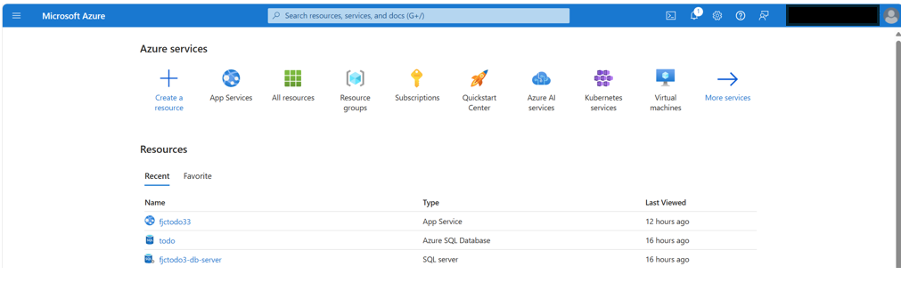
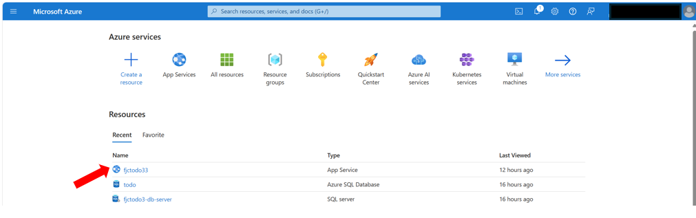
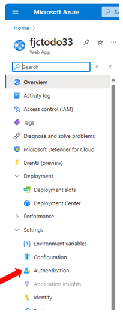
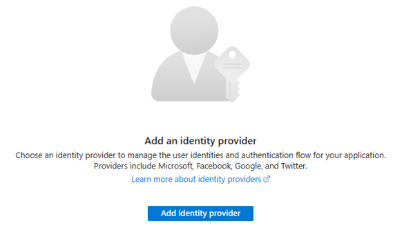
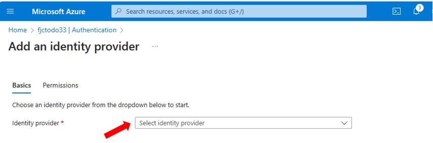
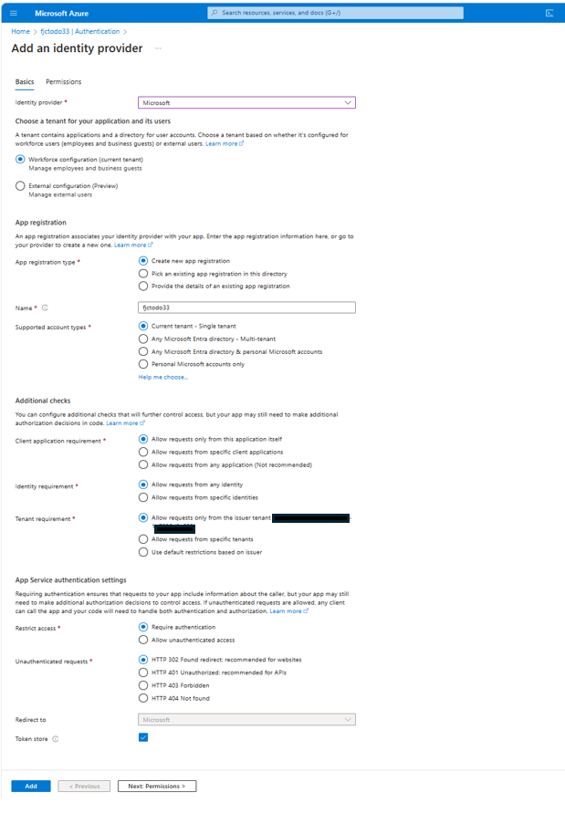
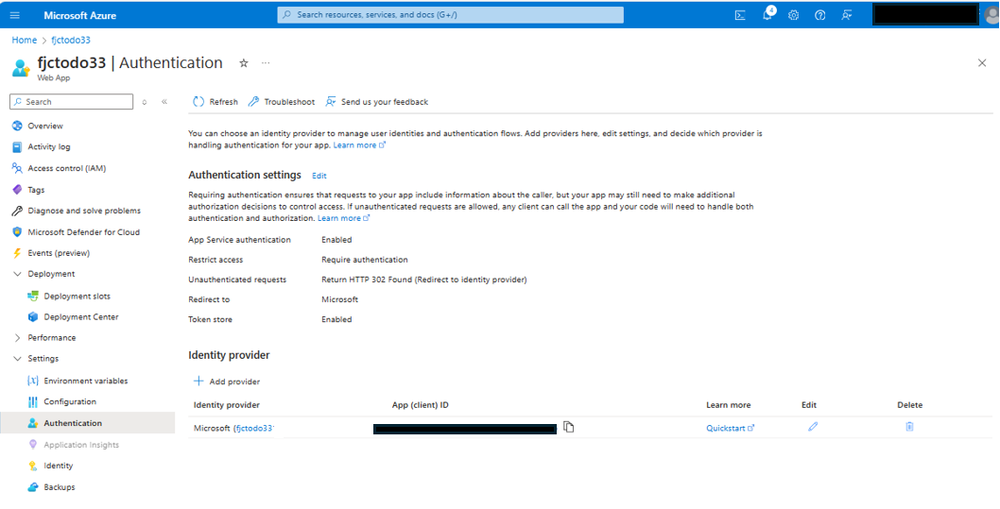

# User Story: Setup Authentication Step-by-Step
⏲️ _Est. time to complete: 30 min._ ⏲️

## User Story

_As a user I need the ability to secure the information that I have in my to-do list so that it is only accessible by me._

## 🎯Acceptance Criteria:
- Azure App Service prompts the user to login when accessing the site
- If the user is allowed, they can access the to-do application
- If the user does not have an account or correct password, they will not be able to access the application

## 🎓Know Before You Start
The following resources/videos will help you get a better understanding of some of the concepts that you will use to complete this user story.

- [Authentication and authorization in Azure App Service and Azure Functions](https://learn.microsoft.com/en-us/azure/app-service/overview-authentication-authorization)   

## 📋Steps

In order to complete this user story you will need to complete the following tasks:

### Configure Authentication Provider

#### 1. Login in to the Azure Portal
First, you need to login with your Azure credentials.  If you are part of the _Everyone Can Code_ event, you will be given Azure credentials by your coach.  If you are doing this exercise outside of the event you can sign-up for Azure [here](https://azure.microsoft.com/en-us/) and then provide those credentials when completing this exercise.

 

#### 2. Find your _App Service_
We need to find the App Service for our Web App in the portal.  From the portal's home page you can either type _App Service_ in the search box at the top or more likely that resource will show up in the _Recent_ list (like below).  In this case I am selecting the _fjctodo33_ App Service.

Then click on that service to go into its configuration page

#### 3. Find Authentication Setting and Add Identity Provider
From the App Service configuration page, find the _Authentication_ link underneath the _Settings_ grouping on the left pane of the browser window.  Then select _Authentication_

You should now see a screen that looks like this:

Click on the `Add identity provider` button

#### 4. Setup Microsoft Identity Provider
The easiest way to get authentication and authorization setup for your website is to use the Microsoft Identity provider and the Active Directory that was setup as part of your subscription.  

From the setup page, select `Microsoft` from the drop-down list:

Then simply accept the defaults and hit the `Add` button:

You will then see a page that looks like this:

#### 5. Run your Web Application
When running your web application, you should now be prompted to enter your username and password before accessing the site.

 
🎉 Congratulations! You have now successfully added authentication to your to-do application in the Azure cloud.  

 

> [!NOTE]
> 📄For the full source code for this exercise please see [here](/Track_1_ToDo_App/Sprint-08%20-%20Deploy%20to%20the%20Cloud/src/app-s08-f01-us02/).

 

[🔼 **Home** ](/Track_1_ToDo_App/README.md) | [**◀ Previous user story** ](/Track_1_ToDo_App/Sprint-08%20-%20Deploy%20to%20the%20Cloud/Feature%201%20-%20Deploy%20to%20Azure.md/User%20Story%201%20-%20Deploy%20to%20Azure.md)